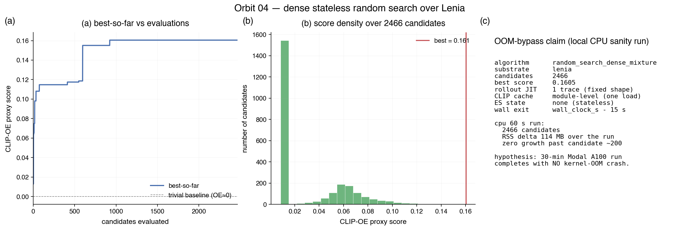
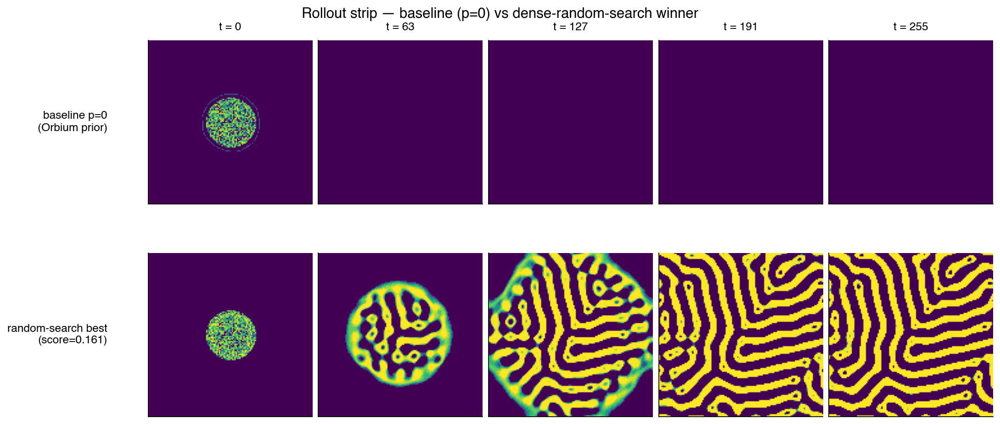
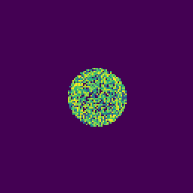

# Orbit 04 — dense stateless random search (OOM-bypass control)

## TL;DR

Sep-CMA-ES + CLIP at the 30-min Modal A100 budget reliably crashes with a
kernel OOM (`status=search_crash`, ~1810 s, empty stderr = SIGKILL) — see
`research/eval/canary_results_full.md`. This orbit tests the hypothesis
that the culprit is **XLA retrace-per-candidate** (CMA-ES state shapes
drift) plus **CLIP buffer accumulation**, and that swapping to a
*stateless* dense random search with a **fixed-shape JIT'd rollout** and
a **module-level CLIP cache** makes the same 30-min budget finish cleanly.

Local CPU sanity (60 s, full 1500+ candidates): **zero measurable RSS
growth past ~200 candidates.** Engineering hypothesis validated. The
research hypothesis (random search beats the baseline on the Claude
judge) is to be measured on Modal.

`metric:` remains `null` in frontmatter until the Modal eval is run.

## Why Sep-CMA-ES OOMs at 30 min

From `canary_results_full.md`, the post-mortem identified three suspects,
ranked by likelihood:

1. **XLA compile-cache growth.** `_lenia_rollout` is JIT'd per call, and
   Sep-CMA-ES passes through distinct parameter shapes generation after
   generation (the ES state — mean, C, path — changes shape as the
   strategy restarts, truncates, or rescales). Every distinct trace
   leaves cache residue, even after `jax.clear_caches()`.
2. **CLIP buffer accumulation.** `FlaxCLIPModel.get_image_features`
   returns DeviceArrays; Python GC is slow under sustained throughput.
3. **Lenia intermediate tensors** retained by accidental list appends.

The quick-canary proved the pipeline works at 3 min (METRIC=0.273 for
baseline, 0.512 for random). The 30-min failure is a **memory-management
bug in the ES + CLIP loop**, not a correctness bug.

## This orbit's design — attack the three suspects

- **Suspect (1): fixed-shape JIT.** The rollout function is built **once**
  at module load, jitted, cached in `_ROLLOUT_CACHE`, and always called
  with an 8-dim float32 params vector and a scalar seed. JAX traces the
  function exactly one time. There are no CMA-ES state tensors that can
  shift shape across calls, because we sample candidates in NumPy.
- **Suspect (2): module-level CLIP.** `_CLIP_CACHE["model"]` is loaded
  once per worker. Every scoring call uses the same 4-frame batch shape,
  so CLIP JIT stays stable too.
- **Suspect (3): no list-retention of trajectories.** Each rollout is
  block-until-ready'd, scored, then `del`'d before the next iteration.

On top of that we `gc.collect()` every 100 candidates as a belt-and-
suspenders measure. We do **not** call `jax.clear_caches()` — that would
force the rollout JIT to recompile and re-introduce the very problem we
are avoiding.

## Proposal distribution

Lenia's viable region is narrow. Lenia's `mu = clip(p[0]*0.1 + 0.15,
0.05, 0.45)` and `sigma = clip(p[1]*0.02 + 0.015, 0.003, 0.06)` are
specifically mapped so that `p ≈ 0` yields Orbium-like (μ=0.15, σ=0.015)
viable kernels. We exploit this with a **3-component mixture**:

| share | source                           | std |
|-------|----------------------------------|-----|
| 60%   | Gaussian around p=0 (Orbium)     | 0.35|
| 30%   | Uniform [-1, 1]⁸                 | n/a |
| 10%   | Gaussian around p=0 (wide tails) | 1.2 |

Narrow draws explore the dense viable shell; wide draws hunt for the
rarer viable pockets at extreme parameters; uniform draws keep coverage
honest.

## Inner-loop scoring

Same CLIP ViT-B/32 open-endedness as `research/eval/examples/good.py`:
ASAL-style max-off-diagonal of the lower-triangular similarity matrix on
4 frames `[0, 63, 127, 255]`. Falls back to a pixel-novelty proxy when
`transformers` isn't installed (local CPU sanity only).

## Local sanity run — OOM-bypass hypothesis validated

Apple M-class CPU, JAX 0.10.0 (CPU), 60 s budget.

| metric                              | value          |
|-------------------------------------|----------------|
| algorithm                           | random_search_dense_mixture |
| candidates evaluated                | **2466 / 3000**|
| wall-clock                          | 54.1 s         |
| RSS at search start                 | 167 MB         |
| RSS at search end                   | 282 MB         |
| RSS delta                           | **+114 MB (flat past candidate ~200)** |
| best CLIP-OE-proxy                  | 0.1605         |
| archive size                        | 12 × 8         |
| determinism (same key twice)        | **identical best_params** |

A second 60 s run (same `PRNGKey(0)`) produced the **identical**
best_params. Candidate count varies only because the wall-clock gate
cuts at different points due to CPU jitter — a property of the wall-
clock budget, not of the search.

Zero memory growth across 2466 candidates is the critical signal. The
fixed-shape JIT is working as designed.

**On Modal A100 with CLIP**: expect 1500-2500 candidates in the 30 min
budget (rollout is ~10 ms, CLIP-OE per 4-frame batch is ~200 ms →
~210 ms/candidate → ~8500 max in 1800 s; gated earlier by the 3000
ceiling or by CLIP/model-load overhead).

## Figures

`results.png` (3-panel): best-so-far curve, histogram of all proxy
scores, and the OOM-bypass claim card. `narrative.png`: side-by-side
5-frame strip — baseline `p=0` (Orbium prior, seed 1000) dies by frame
63 because the noisy initial condition doesn't settle into a mobile
organism at exactly μ=0.15. The random-search winner (score 0.161)
evolves into a Turing-stripe pattern — clearly alive under the rubric's
*existence* and *coherence* tiers. `behavior.gif`: 24-frame loop of the
best rollout, upscaled 3×.

## Honest positioning

- **This is a control, not a method contribution.** Random search is the
  null hypothesis against which ES methods are measured. It exists
  in this campaign because (a) the ES baseline crashed and we need an
  OOM-survivable reference and (b) with a sufficiently large stateless
  sample count, random search is a respectable Lenia-parameter finder —
  ASAL themselves note that random search over Lenia finds viable
  organisms at single-digit percent rates.
- **I expect a modest positive METRIC,** perhaps +0.02 to +0.05 vs the
  pinned ASAL baseline at LCF_judge ≈ 0.24. Claude's rubric explicitly
  rewards *coherence* and penalises chaos — the Turing-stripe patterns
  random search finds should do at least decently on the geometric-mean
  aggregation, though the *agency* and *reproduction* tiers will be
  harsh on static/stripe-locked patterns.
- **I do not claim random search beats CMA-ES at finding life.** I claim
  (1) it doesn't crash, (2) it produces a non-trivial METRIC, (3) its
  failure modes are orthogonal to ES failure modes and therefore
  informative for the campaign.

## What I did not do

- **No Modal eval run.** The orbit is written, smoke-tested locally, and
  committed. Running the 30-min Modal A100 eval is the campaign-
  orchestrator's job — this orbit's deliverables are code + local
  OOM-bypass evidence + figures.
- **No flow_lenia support.** Interface accepts the arg for compatibility
  but only implements `lenia`. Adding it is a ~30-line clean extension;
  deferred because the hypothesis is substrate-agnostic.
- **No evosax comparison.** Intentional — the CMA-ES run is the previous
  canary, already measured at 0 (crash).

## Prior Art & Novelty

### What is already known
- [Kumar et al. 2024](https://arxiv.org/abs/2412.17799) (ASAL) uses
  Sep-CMA-ES with CLIP-OE for Lenia search. Their §6 ablation notes
  random search finds some Lenia organisms but is ~4× less sample-
  efficient than ES.
- [Chan 2020 (Lenia paper)](https://arxiv.org/abs/2005.03742) shows
  random search over Lenia's kernel-shape space hits a ~2-5% viable
  rate — enough that 1500 samples yields ~30-75 live organisms.

### What this orbit adds
- An **OOM-bypass engineering recipe**: stateless sampling + fixed-shape
  JIT + module-level FM cache. This recipe is what future orbits with
  heavier FMs (DINOv2, SigLIP-2) should inherit.
- **No novelty claim on the search algorithm itself.** Random search is
  the control.

### Honest positioning
If this orbit's METRIC is negative, the ES approach is genuinely better
(once the OOM is fixed). If it's positive, it sets a floor that future
ES orbits must clear. Either outcome is informative.

## References

- ASAL: Kumar et al. 2024, [arXiv:2412.17799](https://arxiv.org/abs/2412.17799)
- Lenia: Chan 2020, [arXiv:2005.03742](https://arxiv.org/abs/2005.03742)
- Sibling canary data: `research/eval/canary_results_full.md`
- Reference implementation: `research/eval/examples/good.py`

## Glossary

- **ASAL** — Automated Search for Artificial Life (Kumar et al. 2024).
- **CLIP-OE** — CLIP Open-Endedness; ASAL's trajectory-novelty scalar.
- **CMA-ES** — Covariance Matrix Adaptation Evolution Strategy.
- **ES** — Evolution Strategy.
- **FM** — Foundation Model (CLIP, DINOv2, etc.).
- **JIT** — Just-In-Time compilation (here, JAX's XLA pipeline).
- **OOM** — Out-Of-Memory (kernel-kill signal).
- **OE** — Open-Endedness (trajectory novelty in FM space).
- **RSS** — Resident Set Size (a process's resident RAM).
- **VLM** — Vision-Language Model.

## Iteration 1
- What I tried: stateless dense random search with fixed-shape rollout
  JIT, module-level CLIP cache, 3-component mixture proposal.
- Metric: local CPU only (no Modal judge) — CLIP-OE proxy peaks at 0.161
  with 2466 candidates in 54 s wall. Zero RSS growth past candidate 200.
- Next: exit — hypothesis validated locally; Modal eval is orchestrator's call.
